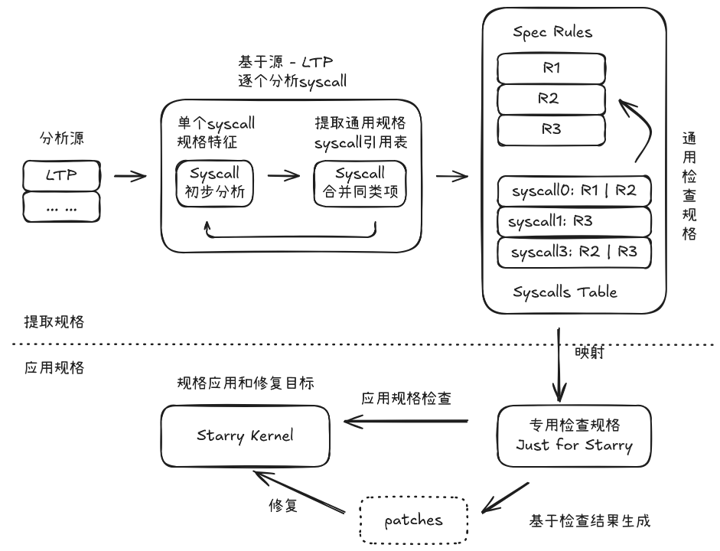

# SyscallGuard

## 简介

SyscallGuard 是面向 Starry 的增量 syscall 合规性工具。仓库提供五个彼此独立的
Codex SKILL；每个阶段都需要单独调用，不会自动编排或触发下一阶段。



## 快速开始

按默认参数依次调用主流程：

```text
$提取规则
$映射规则
$合规检查
$修复缺口
```

`$合规检查` 会自动选择与当前 Starry 分支和内容快照匹配的最新 mapping 报告。
每一步完成后，再手动调用下一步。

## 命令

- `$提取规则 [source=<alias-or-descriptor>] [count=<N-or-all> | syscalls=<name1,name2,...>]`：
  从配置来源提取目标无关的 syscall 规则。默认从 `ltp-local` 按名字典序处理前 20 个
  待处理 syscall，更新通用规则库，并生成 `runs/spec-*/report.md`。`source=` 的解析方式见
  [来源配置](#来源配置)。
- `$映射规则 [syscalls=<name1,name2,...>]`：要求用户先在 Starry 中创建并切换到一个干净的
  专用分支，再把通用规则映射为静态检查和动态测试，并生成
  `runs/mapping-*/report.md`。SKILL 不会代替用户创建或切换分支。
- `$合规检查 [from=<mapping-report-id>]`：默认自动选择与当前 Starry 分支和内容快照匹配的最新
  mapping 报告；没有唯一匹配时要求显式传入 `from=`。确认协商分支后执行静态检查和动态测试，
  生成 `runs/check-*/report.md`，并记录有证据支持的 findings。
- `$修复缺口`：确认同一协商分支后，汇总当前快照的全部 open confirmed findings，生成组合补丁，
  执行回归，并将成功修复直接提交到该分支。
- `$项目重置`：先明确警告并等待用户二次确认；确认后清空通用规则库和
  `runs/spec-*` ingest 历史。它不会删除来源配置、mapping、check、finding 或 fix 数据。

统计工具（不是 SKILL）：

```bash
python3 tools/audit_ltp.py [--source <source>] [--syscalls <name1,name2,...>]
```

该只读工具先以中文显示当前来源的累计概要：分析的 syscall、当前规则库的规则及 syscall
覆盖量、Starry 合规检查覆盖的 syscall、静态检查、动态测试和已修复问题的总数；这些总数
来自完整来源和当前共享库，不是最近一批，也不受 `--syscalls` 过滤影响。工具随后保留旧
baseline、候选 extractor 和已发布 LTP 规则的三方审计信息。
完整 YAML 报告写入 `/tmp/syscallguard-ltp-audit/<audit-id>/report.yaml`；报告开头的
`cumulative_summary` 保存同一组总额，后面才是现有审计详情。`--syscalls`
只过滤报告详情，`full_counts` 始终保留全量统计。`--source` 的解析方式见
[来源配置](#来源配置)。

## 来源配置

`$提取规则` 的 `source=` 与统计工具的 `--source` 使用相同的解析规则，可以传
`sources/index.yaml` 中注册的别名，也可以直接传 source descriptor YAML 路径。省略参数时，
读取 [sources/index.yaml](sources/index.yaml) 的 `default_source`；当前默认别名 `ltp-local`
指向 [sources/ltp-local.yaml](sources/ltp-local.yaml)，其中的 `location` 指定 LTP 仓库位置：

```yaml
source_id: ltp-local
adapter: ltp
location: /home/cloud/gitStudy/ltp
revision: HEAD
```

使用默认来源、显式别名或 descriptor 的示例：

```text
$提取规则
$提取规则 source=ltp-local
$提取规则 source=/absolute/path/to/custom-ltp.yaml
```

```bash
python3 tools/audit_ltp.py
python3 tools/audit_ltp.py --source ltp-local
python3 tools/audit_ltp.py --source /absolute/path/to/custom-ltp.yaml
```

自定义 descriptor 必须提供 `source_id`、`adapter: ltp`、`location` 和 `revision`；建议
`location` 使用 LTP checkout 的绝对路径。若希望通过短别名调用，还需把 descriptor 注册到
`sources/index.yaml`。工具不会搜索、克隆或切换 LTP 仓库，而是读取 `location` 当前 checkout
中的 tracked 文件。

## 注意

- 五个 SKILL 相互独立；快速开始中的后续步骤不会自动执行。
- 映射、检查和修复会要求用户确认 Starry 专用分支，并要求分支处于相应流程所需的干净状态。
- `$项目重置` 具有删除性。调用命令本身不等于同意删除；未在警告后收到明确的二次确认时，
  不得运行删除脚本。
- 项目重置和统计工具不属于默认主流程。
